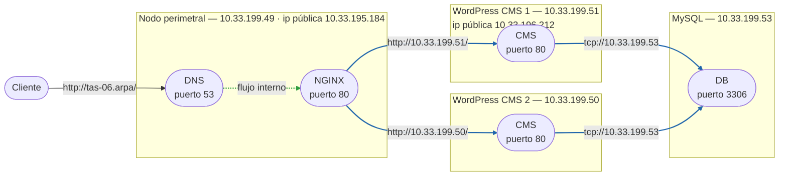

Versión hecha con : https://excalidraw.com/

![[diagrama-despliegue.png]]

### Versión para .md: 

```mermaid
flowchart LR
    cliente(["Cliente"])

    subgraph PERIM["Nodo perimetral — 10.33.199.49 · ip pública 10.33.195.184"]
        direction LR
        dns(["DNS<br/>puerto 53"])
        nginx(["NGINX<br/>puerto 80"])
        dns -.->|flujo interno| nginx
    end

    subgraph CMS1["WordPress CMS 1 — 10.33.199.51<br/>ip pública 10.33.196.212"]
        cms1(["CMS<br/>puerto 80"])
    end

    subgraph CMS2["WordPress CMS 2 — 10.33.199.50"]
        cms2(["CMS<br/>puerto 80"])
    end

    subgraph DBSQL["MySQL — 10.33.199.53"]
        db(["DB<br/>puerto 3306"])
    end

    cliente -->|"http://tas-06.arpa/"| dns
    nginx -->|"http://10.33.199.51/"| cms1
    nginx -->|"http://10.33.199.50/"| cms2
    cms1 -->|"tcp://10.33.199.53"| db
    cms2 -->|"tcp://10.33.199.53"| db

    linkStyle 0 stroke:#2e9e3f,stroke-width:2px
    linkStyle 2,3,4,5 stroke:#2166ac,stroke-width:2px
```