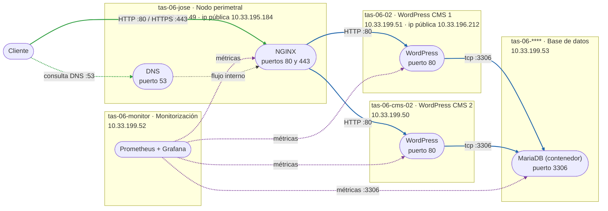

```mermaid
flowchart LR
    cliente(["Cliente"])

    subgraph PERIM["tas-06-jose · Nodo perimetral<br/>10.33.199.49 · ip pública 10.33.195.184"]
        direction LR
        dns(["DNS<br/>puerto 53"])
        nginx(["NGINX<br/>puertos 80 y 443"])
    end

    subgraph CMS1["tas-06-02 · WordPress CMS 1<br/>10.33.199.51 · ip pública 10.33.196.212"]
        cms1(["WordPress<br/>puerto 80"])
    end

    subgraph CMS2["tas-06-cms-02 · WordPress CMS 2<br/>10.33.199.50"]
        cms2(["WordPress<br/>puerto 80"])
    end

    subgraph DBSQL["tas-06-**** · Base de datos<br/>10.33.199.53"]
        db(["MariaDB (contenedor)<br/>puerto 3306"])
    end

    subgraph MON["tas-06-monitor · Monitorización<br/>10.33.199.52"]
        mon(["Prometheus + Grafana"])
    end

    cliente -.->|"consulta DNS :53"| dns
    cliente -->|"HTTP :80 / HTTPS :443"| nginx
    nginx -->|"HTTP :80"| cms1
    nginx -->|"HTTP :80"| cms2
    cms1 -->|"tcp :3306"| db
    cms2 -->|"tcp :3306"| db
    mon -.->|"métricas :3306"| db
    mon -.->|"métricas"| nginx
    mon -.->|"métricas"| cms1
    mon -.->|"métricas"| cms2
    dns -.->|"flujo interno"| nginx

    linkStyle 0,1 stroke:#2e9e3f,stroke-width:2px
    linkStyle 2,3,4,5 stroke:#2166ac,stroke-width:2px
    linkStyle 6,7,8,9 stroke:#7d3c98,stroke-width:2px
```