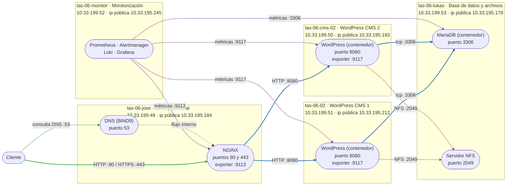

```mermaid
flowchart LR
    cliente(["Cliente"])

    subgraph PERIM["tas-06-jose · Nodo perimetral<br/>10.33.199.49 · ip pública 10.33.195.184"]
        direction LR
        dns(["DNS (BIND9)<br/>puerto 53"])
        nginx(["NGINX<br/>puertos 80 y 443<br/>exporter :9113"])
    end

    subgraph CMS1["tas-06-02 · WordPress CMS 1<br/>10.33.199.51 · ip pública 10.33.195.212"]
        cms1(["WordPress (contenedor)<br/>puerto 8080<br/>exporter :9117"])
    end

    subgraph CMS2["tas-06-cms-02 · WordPress CMS 2<br/>10.33.199.50 · ip pública 10.33.195.193"]
        cms2(["WordPress (contenedor)<br/>puerto 8080<br/>exporter :9117"])
    end

    subgraph DBN["tas-06-lukas · Base de datos y archivos<br/>10.33.199.53 · ip pública 10.33.195.178"]
        db(["MariaDB (contenedor)<br/>puerto 3306"])
        nfs(["Servidor NFS<br/>puerto 2049"])
    end

    subgraph MON["tas-06-monitor · Monitorización<br/>10.33.199.52 · ip pública 10.33.195.245"]
        mon(["Prometheus · Alertmanager<br/>Loki · Grafana"])
    end

    cliente -.->|"consulta DNS :53"| dns
    cliente -->|"HTTP :80 / HTTPS :443"| nginx
    nginx -->|"HTTP :8080"| cms1
    nginx -->|"HTTP :8080"| cms2
    cms1 -->|"tcp :3306"| db
    cms2 -->|"tcp :3306"| db
    cms1 -.->|"NFS :2049"| nfs
    cms2 -.->|"NFS :2049"| nfs
    mon -.->|"métricas :3306"| db
    mon -.->|"métricas :9113"| nginx
    mon -.->|"métricas :9117"| cms1
    mon -.->|"métricas :9117"| cms2
    dns -.->|"flujo interno"| nginx

    linkStyle 0,1 stroke:#2e9e3f,stroke-width:2px
    linkStyle 2,3,4,5 stroke:#2166ac,stroke-width:2px
    linkStyle 6,7 stroke:#b45f06,stroke-width:2px
    linkStyle 8,9,10,11 stroke:#7d3c98,stroke-width:2px
```